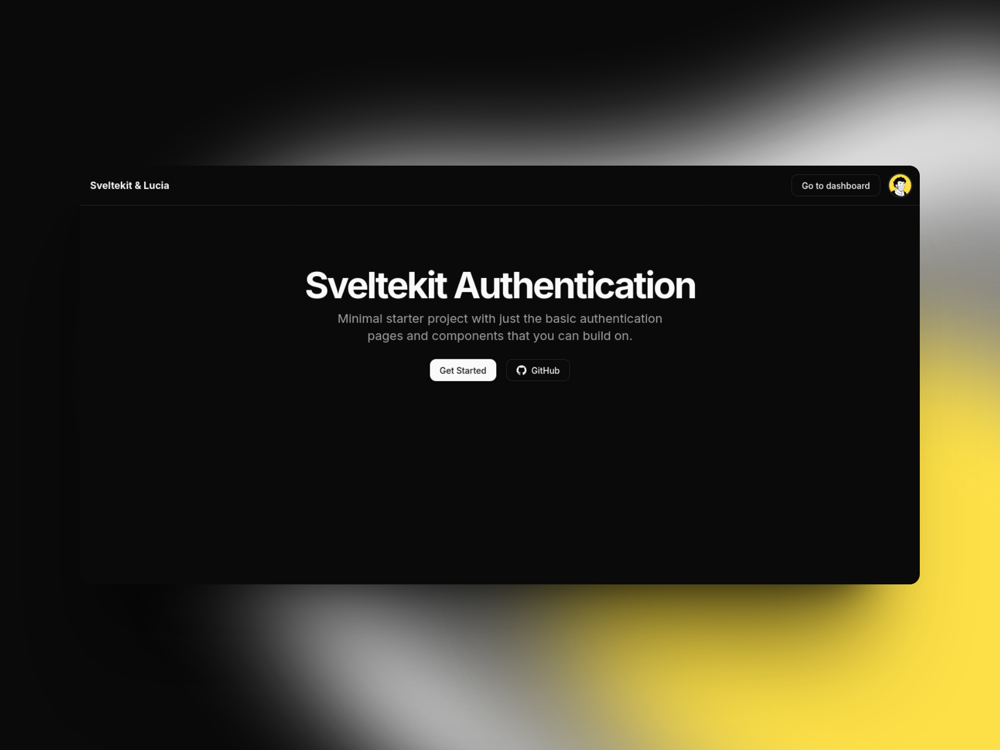

# Sveltekit Authentication with Lucia & Drizzle ORM

Minimal starter project with just the basic authentication pages and components that you can build on.



## Features

- Email - Password auth with verification codes + rate limiting
- Google & Github Oauth
- Authentication Modals
- Account linking
- Shadcn-svelte + Superforms
- Turso DB + Drizzle ORM (swap with your preferred db, just follow drizzle docs)

## Setup

To setup the project you need to first create a local **Libsql** database and run the drizzle scripts to set up the database and then start the dev server.

### Create Local DB

- In project root, add `db/sqlite.db`

### Set Environment Variables

- Change `.env.example` --> `.env`
- Update keys to enable Oauth & Resend verification emails

### Run scripts

```ts
pnpm db:generate
pnpm db:push
pnpm dev
```

### Building

To create a production version of your app:

```bash
pnpm run build
```
